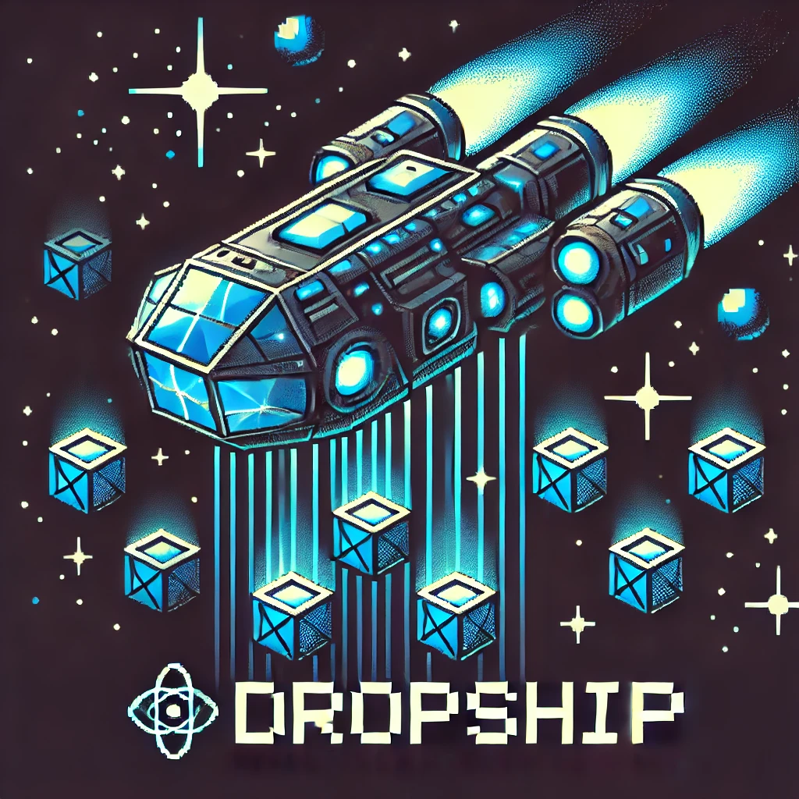

Dropship is a component library designed to provide reusable UI components for
frontend web projects. It's a hobby project of mine that I enjoy working on
because I love component (design) systems and this gives me the experience of
working on one of my own creation.

**By no means, Dropship is not a library you should be using in a professional
production environment, as it's is always evolving and frequently has breaking
changes made that I just don't have the time to support.**

**Tech:**

- React 18
- Storybook 8
- Pigment-CSS
- Chromatic
- TypeScript
- Vite

**Features:**

- Atoms: Blockquote, Box, Button, Container, Grid, Heading, Link, Row, Spacer.
- Storybook: Build, test, and document UI components in isolation.
- Chromatic: Releases are tested for visual regressions.
- Design Tokens: Dropship is grounded in the practice of using design tokens to
  create a consistent (design) system and follows the DTCG format
  [https://tr.designtokens.org/](https://tr.designtokens.org/).

Dropship is compatible and tested for client-side rendering, Next.js SSR, and
React Server Components (RSC).
